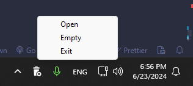

"Science isn't about WHY. It's about WHY NOT. Why is so much of our science dangerous? Why not marry safe science if you love it so much. In fact, why not invent a special safety door that won't hit you on the butt on the way out, because you are fired." — Cave Johnson (Portal 2)

# Recycle tray 
Adds the recycle bin icon to the system tray. <br>
***For now it only supports Windows.*** <br>
Technically it is **[recycle-tray](https://github.com/isc30/recycle-tray)**, but in ***🚀rust🚀***



# How to use
1. Download
2. Open
3. Profit 🚀🚀🚀

# How to add to startup
1. Win + R
2. ```shell:startup```
3. move executable to folder
